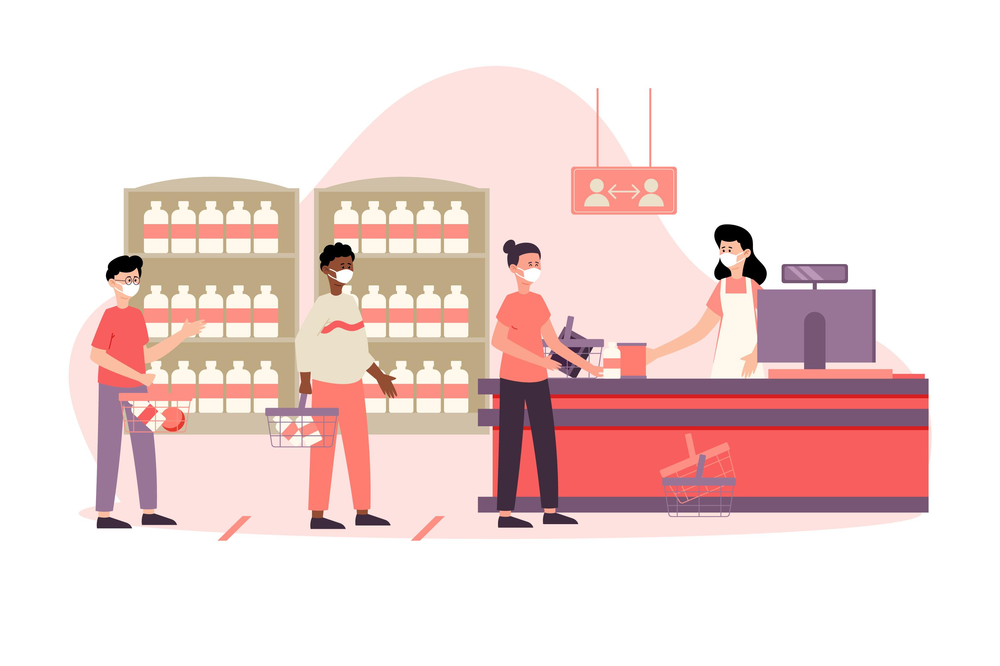

# Queue



## [Table of Contents](#table-of-contents) 
  - [The Concept](#the-concept)
  - [Main Operations](#main-operations)
    - [Transformers](#transformers)
        - [**enQueue** operation](#enqueue-operation)
        - [**deQueue** operation](#dequeue-operation)
    - [Observers](#observers)
        - [**peek()** operation](#peek-operation)
        - [**isEmpty()** operation](#isempty-operation)
        - [**isFull()** operation](#isfull-operation)
  - [Types of Queues](#types-of-queues)
    - [Circular Queue](#circular-queue)
    - [Priority Queue](#priority-queue)
    - [Double Ended Queue](#double-ended-queue)
  
  &nbsp;

## The Concept
**Queue** is a linear data structure in which the insertion and deletion operations are performed at two different ends. In a `queue` data structure, adding and removing elements are performed at two different positions. The insertion is performed at one end and deletion is performed at another end.

Fundamentally, they honor the **First In, First Out (FIFO)** strategy, that is the item first put into the `queue` will be the first served, the second item added to the `queue` will be the second to be served and so on.  
A traditional `queue` only allows you to access the item at the front of the `queue`; when you add an item to the queue that item is placed at the back of the `queue`.

The following is to illustrate the addition and insertion operation on a `queue`.  


## Main Operations
Queues maintain two data pointers, `front` and `rear`. Therefore, its operations are comparatively difficult to implement than that of stacks.  
Operations can be performed both at the start and at the end of the sequence, thus the operations are performed in a **First In First Out (FIFO) manner.**
### Transformers
 - **enQueue**
 - **deQueue**

#### **enQueue Operation**
The following steps should be taken to enQueue (insert) data into a `queue`:  
- **Step 1** − Check if the `queue` is full.
- **Step 2** − If the `queue` is full, produce overflow error and exit.
- **Step 3** − If the `queue` is not full, increment `rear` pointer to point the next empty space.
- **Step 4** − Add data element to the `queue` location, where the `rear` is pointing.
- **Step 5** − return success.

Sometimes, we also check to see if a `queue` is initialized or not, to handle any unforeseen situations.  
Here's the pseudocode for **`enQueue()`** operation:  
```
procedure enQueue(data)      
  if queue is full
    return overflow
  endif
  rear ← rear + 1
  queue[rear] ← data
  return true
end procedure
```

#### **deQueue Operation**
Accessing data from the `queue` is a process of two tasks − access the data where `front` is pointing and remove the data after access.  
The following steps are taken to perform `deQueue` operation:
- **Step 1** − Check if the `queue` is empty.
- **Step 2** − If the queue is empty, produce underflow error and exit.
- **Step 3** − If the `queue` is not empty, access the data where `front` is pointing.
- **Step 4** − Increment front pointer to point to the next available data element.
- **Step 5** − Return success.

Here's the pseudocode for `deQueue` operation:
```
procedure dequeue
  if queue is empty
    return underflow
  end if
  data = queue[front]
  front ← front + 1
  return true
end procedure
```


### Observers
Let's learn about supportive functions of a `queue`.
- `peek()`
- `isFull()`
- `isEmpty()`

### `peek()` Operation
This function helps to see the data at the `front` of the `queue`.  
The algorithm of `peek()` function is as follows −
```
begin procedure peek
  return queue[front]
end procedure
```
### `isFull()` Operation
As we are using single dimension array to implement `queue`,  
we just check for the `rear` pointer to reach at `MAXSIZE` to determine that the `queue` is full.  
In case we maintain the `queue` in a circular linked-list, the algorithm will differ.  
Algorithm of `isFull()` function −
```
begin procedure isfull
  if rear equals to MAXSIZE
    return true
  else
    return false
  endif 
end procedure
```
### `isEmpty()` Operation
If the value of `front` is less than `MIN` or 0, it tells that the `queue` is not yet initialized, hence empty.
Algorithm of `isEmpty()` function –
```
begin procedure isempty
  if front is less than MIN  OR front is greater than rear
    return true
  else
    return false
  endif
end procedure
```
## Types of Queues
There are four different types of queues:
- Simple Queue
- Circular Queue
- Priority Queue
- Double Ended Queue


### Circular Queue
In a `circular queue`, the last element points to the first element making a circular link.

As you can see in the image below, after a bit of enqueuing and dequeuing, the size of the queue has been reduced.


And we can only add indexes 0 and 1 only when the queue is reset (when all the elements have been dequeued).

After `rear` reaches the last index, if we can store extra elements in the empty spaces (0 and 1), we can make use of the empty spaces. This is implemented by a modified queue called the circular queue.

Circular Queue works by the process of circular increment i.e. when we try to increment the pointer and we reach the end of the queue, we start from the beginning of the `queue`.

Here, the circular increment is performed by modulo division with the queue size. That is,
```
if REAR + 1 == size (overflow!), REAR = (REAR + 1)%size = 0 (start of queue)

```

However, the check for full queue has a new additional case:

- Case 1: FRONT = 0 && REAR == SIZE - 1 
- Case 2: FRONT = REAR + 1  

The second case happens when REAR starts from 0 due to circular increment and when its value is just 1 less than FRONT, the queue is full.

The complexity of the `enqueue` and `dequeue` operations of a circular queue is `O(1)` for (array implementations).

Applications of Circular Queue
- CPU scheduling
- Memory management
- Traffic Management

### **Double Ended Queue**
Deque or Double Ended Queue is a type of `queue` in which insertion and removal of elements can either be performed from the front or the rear.  
Thus, it does not follow FIFO rule (First In First Out).


**Types of Deque**
- **Input Restricted Deque**  
  In this deque, input is restricted at a single end but allows deletion at both the ends.
- **Output Restricted Deque**  
   In this deque, output is restricted at a single end but allows insertion at both the ends.

The time complexity of all the above operations is constant i.e. `O(1)`.

**Applications of Deque Data Structure**
- In undo operations on software.
- To store history in browsers.
- For implementing both stacks and queues.

### **Priority Queue**
A `priority queue` is a special type of queue in which each element is associated with a priority value.  
And, elements are served on the basis of their priority. That is, higher priority elements are served first.  

**Assigning Priority Value**  
Generally, the value of the element itself is considered for assigning the priority. For example,

The element with the highest value is considered the highest priority element. However, in other cases, we can assume the element with the lowest value as the highest priority element.

We can also set priorities according to our needs.


**Characteristics of Priority Queue**   
Priority queue in a data structure is an extension of a linear queue that possesses the following properties:
- Every element has a certain priority assigned to it.
- Every element of this queue must be comparable.
- It will delete the element with higher priority before the element with lower priority.
- If multiple elements have the same priority, it does their removal from the queue according to the FIFO principle.


**Implementation of Priority Queue**  
`Priority queue` can be implemented using an array, a linked list, a heap data structure, or a binary search tree.  
Among these data structures, heap data structure provides an efficient implementation of priority queues.  
A comparative analysis of different implementations of priority queue is given below.

|  **Operations** | peek  | insert  |delete   |
|:-:|---|---|---|
|  Linked List | O(1)  |  O(n) | O(1)  |
|  Binary Heap |  O(1) | O(log n)  | O(log n)  |
|  Binary Search Tree | O(1)  | O(log n)  |  O(log n) |

**Applications of Priority Queue**  
- Priority queues are used to sort heaps.
- Priority queues are used in operating system for load balancing and interrupt handling.
- Priority queues are used in **huffman** codes for data compression.
