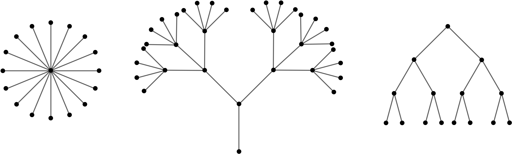

# Graphs

## [Table of Contents](#table-of-contents)

- [Graphs](#graphs)
  - [Table of Contents](#table-of-contents)
  - [Definition](#definition)
  - [History](#history)
  - [Graph Terminology](#graph-terminology)
  - [Types of Graphs](#types-of-graphs)
  - [Representations](#representations)
    - [**Edge lists**](#edge-lists)
    - [**Adjacency Matrices**](#adjacency-matrices)
    - [**Incidence Matrices**](#incidence-matrices)
    - [**Adjacency lists**](#adjacency-lists)
    - [**Representations' evaluation**](#representations-evaluation)
  - [Haven't we ever used graphs?](#havent-we-ever-used-graphs)
  - [Applications](#applications)
  - [Some Experience Sharing](#some-experience-sharing)

## Definition

In computer science, graph theory is the study of graphs,  
a mathematical structure used to model pair wise relations between objects from a certain collection.

In one restricted but very common sense of the term,  
a graph is an ordered pair  comprising:

- , a set of **vertices** (also called **nodes** or **points**):  ;
- , a set of **edges** (also called **links** or **lines**),  
  which are unordered pairs of vertices (that is, an edge is associated with two distinct vertices).

To avoid ambiguity, this type of object may be called precisely an **undirected simple graph**.

Let's quickly look at the following example:


- 
- 

## History

The **Seven Bridges of Königsberg** is a historically notable problem in mathematics.  
Its negative resolution by Leonard Euler in 1736 laid the foundations of graph theory.

The city of **Königsberg** in Prussia (now Kaliningrad, Russia) was set on both sides of the **Pregel** River,  
and included two large islands— **Kneiphof** and **Lomse** — which were connected to each other,  
or to the two mainland portions of the city, by seven bridges.


**The problem was to devise a walk through the city that would cross each of those bridges once and only once.**

Here's a [playground](https://mathigon.org/course/graph-theory/bridges) to try solutions.

However, no need to try hard, as Euler proved that there is no solution to the problem.

## Graph Terminology

Let's understand the main concepts of a graph on the following example:
| **Terminology** | **Definition** | **Example Graph** |
|:----------------:|-----------------|--------------------|
| **Vertex(Node)** | Each node of the graph is called a vertex. |  |
| **Edge** | The link or path between two vertices is called an edge. |  |
| **Adjacent nodes** | If two nodes are connected by an edge then they are called adjacent nodes or neighbors. |  |
| **Adjacent edges** | Adjacent edges are edges that share a common vertex. |  |
| **Degree of the Node** | The number of edges that are connected to a particular node is called the degree of the node. |  |
| **Path** | The sequence of nodes that we need to follow when we have to travel from one vertex to another in a graph is called the path. |  |
| **Circuit(Closed path)** | If the initial node is the same as a terminal node, then that path is termed as circuit. |  |
| **Cycle** | A circuit in which all the other nodes are distinct is called a cycle. |  |

## Types of Graphs

The following table represents the types of graphs and their examples:
| **Name** | **Definition** | **Example Graph** |
|:--------:|----------------|-------------------|
| **Null Graph** |A graph whose edge set is empty is called as a null graph. | |
|**Trivial Graph** |A graph having only one vertex in it is called as a trivial graph. It's smallest possible graph. | |
| **Connected Graph** | A connected graph is the one in which there is a path between each of the vertices. This means that there is not a single vertex which is isolated or without a connecting edge. |  |
| **Complete Graph** | A graph in which each node is connected to another is called a complete graph. If  is the total number of nodes in a graph then the complete graph contains  number of edges.|  |
| **Weighted Graph** | A positive value assigned to each edge indicating its length (distance between the vertices connected by an edge) is called weight. The graph containing weighted edges is called a weighted graph |  |
| **Directed Graph** | A directed graph is a graph in which every edge is associated with a specific direction and the traversal can be done in specified direction only |  |
|**Planar Graph** |A planar graph is a graph that we can draw in a plane such that no two edges of it cross each other. [Playground](https://mathigon.org/course/graph-theory/planar-graphs) | |
|**Multi-Graph** |The multi-graph is a graph in which multiple edges are allowed. Multiple edges are two or more edges that connect the same two vertices. | |
|**Pseudo-Graph**| A pseudo-graph is a graph in which graph loops are permitted.|  |

## Representations

There are several ways to represent graphs, each with its advantages and disadvantages.  
Some situations, or algorithms that we want to run with graphs as input, call for one representation, and others call for a different representation.  
Here, we'll see a few ways to represent graphs.

We'll look at 3 criteria.

1. One is how much memory, or space, we need in each representation.  
   It's really a way to characterize functions, and a function can describe a running time, an amount of space required, or some other resource.
2. One is how long it takes to determine whether a given edge is in the graph.
3. The other is how long it takes to find the neighbors of a given vertex.

Let's consider an example graph:


### **Edge lists**

One simple way to represent a graph is just a list, or array, of  edges, which we call an **edge list**.

To represent an edge, we just have an array of two vertex numbers.  
If edges have weights, add either a third element to the array or more information to the object, giving the edge's weight.  
Since each edge contains just two or three numbers, the total space for an edge list is .  
For the example graph the **edge list** representation will have the following structure:

```javascript
[
  [0, 1],
  [0, 6],
  [0, 8],
  [1, 4],
  [1, 6],
  [1, 9],
  [2, 4],
  [2, 6],
  [3, 4],
  [3, 5],
  [3, 8],
  [4, 5],
  [4, 9],
  [7, 8],
  [7, 9],
];
```

Edge lists are simple, but if we want to find whether the graph contains a particular edge,  
we have to search through the edge list.

If the edges appear in the edge list in no particular order, that's a linear search through  edges.

**Question to think about**: How can you organize an edge list to make searching for a particular edge take  time?

### **Adjacency Matrices**

For a graph with  vertices, an adjacency matrix is a  matrix of 0s and 1s,  
where the entry in row  and column  is 1 if and only if the edge  is in the graph.

Here's the adjacency matrix for the example graph:


In JS, we'll represent the adjacency matrix as:

```JavaScript
[ [0, 1, 0, 0, 0, 0, 1, 0, 1, 0],
  [1, 0, 0, 0, 1, 0, 1, 0, 0, 1],
  [0, 0, 0, 0, 1, 0, 1, 0, 0, 0],
  [0, 0, 0, 0, 1, 1, 0, 0, 1, 0],
  [0, 1, 1, 1, 0, 1, 0, 0, 0, 1],
  [0, 0, 0, 1, 1, 0, 0, 0, 0, 0],
  [1, 1, 1, 0, 0, 0, 0, 0, 0, 0],
  [0, 0, 0, 0, 0, 0, 0, 0, 1, 1],
  [1, 0, 0, 1, 0, 0, 0, 1, 0, 0],
  [0, 1, 0, 0, 1, 0, 0, 1, 0, 0] ]
```

With an adjacency matrix, we can find out whether an edge is present in constant time.

So what's the disadvantage of an adjacency matrix? **Two things**, actually.

**First**, it takes  space. The adjacency matrix is mostly 0s, and we use lots of space to represent only a few edges.

**Second**, if you want to find out which vertices are adjacent to a given vertex ,  
you have to look at all  entries in row , even if only small number of vertices are adjacent to vertex .

### **Incidence Matrices**

For a graph with  vertices, an adjacency matrix is a  matrix of 0s and 1s,  
where the entry in row  and column  is 1 if and only if the vertex  is incident to vertex in the graph.

Let's consider the following example:


|       |  |  |  |  |
| :---: | ------- | ------- | ------- | ------- |
| **1** | 1       | 1       | 1       | 0       |
| **2** | 1       | 0       | 0       | 0       |
| **3** | 0       | 1       | 0       | 1       |
| **4** | 0       | 0       | 1       | 1       |

In JS, we'll represent the adjacency matrix as:

```JavaScript
[ [1, 1, 1, 0],
  [1, 0, 0, 0],
  [0, 1, 0, 1],
  [0, 0, 1, 1] ]
```

Incidence Matrices are similar to adjacency matrices, they have mainly the same disadvantages.

**First**, it takes  space.  
**Second**, if you want to find out which edges are incident to a given vertex ,  
you have to look at all  entries in row , even if only small number of edges are incident to vertex .

### **Adjacency lists**

Representing a graph with adjacency lists combines adjacency matrices with edge lists.  
For each vertex , store an array of the vertices adjacent to it.  
We typically have an array of  adjacency lists, one adjacency list per vertex.  
Here's an adjacency-list representation of the example graph:


In JavaScript, we represent these adjacency lists by:

```JavaScript
[ [1, 6, 8],
  [0, 4, 6, 9],
  [4, 6],
  [4, 5, 8],
  [1, 2, 3, 5, 9],
  [3, 4],
  [0, 1, 2],
  [8, 9],
  [0, 3, 7],
  [1, 4, 7] ]
```

Vertex numbers in an adjacency list are not required to appear in any particular order,  
though it is often convenient to list them in increasing order, as in this example.

We can get to each vertex's adjacency list in constant time, because we just have to index into an array.  
To find out whether an edge  is present in the graph, we go to 's adjacency list in constant time and then look for  in 's adjacency list.

**How long does that take in the worst case?**  
The answer is , where  is the degree of vertex , because that's how long 's adjacency list is.

The degree of vertex  could be as high as  (if  is adjacent to all the other  vertices) or as low as 0 (if  is isolated, with no incident edges).

**How much space do adjacency lists take?**  
We have  lists, and although each list could have as many as  vertices,  
in total the adjacency lists for an undirected graph contain  elements.  
Why ? Each edge  appears exactly twice in the adjacency lists, once in 's list and once in 's list, and there are  edges.

### **Representations' evaluation**

Let's evaluate the representations we've discussed.
Imagine the situation where we have to choose a technique to represent **Facebook**'s users' relations (friend/non-friend).

Let's also do the following assumptions:

- **Facebook total users**: 
- **User's total friends**: 


## Haven't we ever used graphs?

Isn't there any chance that we've already used graphs without actually calling them graphs?
Let's remember the definition of the tree.

A tree
is a non-linear
data structure that represents the hierarchy.  
A tree is a collection of nodes that are linked together to form a hierarchy.


For, we already know the graph definition, let's look at this example:


Is there any difference between the previous tree and this graph?

Actually, no. This graph is the previous tree 90 degree rotated.  
So, a reasonable question arises. Can we define a tree from graph's aspect?  
The answer is yes.

**Tree** is **an undirected graph** in which any two vertices are connected by exactly one path.

Also, there's such graph called **forest**.  
A **forest** is an undirected graph in which any two vertices are connected by at most one path, or equivalently a disjoint union of trees.  
Here's an example of a forest:


## Applications

1. **Dijkstra’s Shortest Paths Algorithm**  
   Google Maps and Routes APIs are classic Shortest Path APIs. This a graph problem that's very easy to solve with edge-weighted directed graphs (digraphs).  
   The idea of a Map API is to find the shortest path from one vertex to every other as in a single source shortest path variant, from your current location to every other destination you might be interested in going to on the map.
   

2. **Linguistics**  
   In linguistics, graphs are mostly used for parsing of a language tree and grammar of a language tree.  
   Semantics networks are used within lexical semantics, especially as applied to computers, modeling word meaning is easier when a given word is understood in terms of related words.

3. **Physics and Chemistry**
   In physics and chemistry, graph theory is used to study molecules.  
   Graph is also helpful in constructing the molecular structure as well as lattice of the molecule.  
   It also helps us to show the bond relation in between atoms and molecules, also help in comparing structure of one molecule to others.

4. **Facebook Graph**
   On Facebook, users are considered to be the vertices and if they are friends then there is an edge running between them.  
   Facebook’s Friend suggestion algorithm uses graph theory.

5. **World Wide Web**
   In World Wide Web, web pages are considered to be the vertices. There is an edge from a page u to other page v if there is a link of page v on page u.  
   This is an example of Directed graph. It was the basic idea behind [Google Page Ranking Algorithm](https://www.geeksforgeeks.org/page-rank-algorithm-implementation/).

6. **Connected components' algorithm**  
   The connected components' algorithm is a graph theory algorithm used to find the connected components of a graph.  
   It is a simple algorithm that takes into account the edges and vertices of a graph.

## Some Experience Sharing
