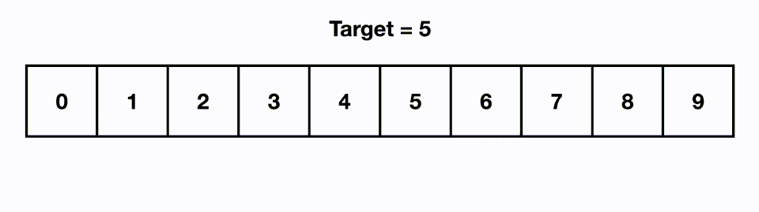

# Binary Search

## [Table of Contents](#table-of-contents)

- [Binary Search](#binary-search)
  - [Table of Contents](#table-of-contents)
  - [Definition](#definition)
  - [Algorithm](#algorithm)
  - [Complexity](#complexity)
  - [Applications](#applications)
  - [Limitations](#limitations)
  - [Implementations](#implementations)

## Definition

In computer science, **binary search**, also known as half-interval search, logarithmic search  
or binary chop, is a search algorithm that finds the position of a target value within a **sorted array**.

For this algorithm to work properly, the data collection should be in the sorted form.  
Binary search looks for a particular item by comparing the middle most item of the collection.  
If a match occurs, then the index of item is returned.

If the middle item is greater than the item, then the item is searched in the sub-array to the left of the middle item. Otherwise, the item is searched for in the sub-array to the right of the middle item. This process continues on the sub-array as well until the size of the subarray reduces to zero.

## Algorithm

Given an array $A$ of $n$ elements with values or records $A_{0},A_{1},A_{2},\ldots ,A_{n-1}$  
sorted such that $A_{0}\leq A_{1}\leq A_{2}\leq \cdots \leq A_{n-1}$, and target value $T$,  
the following subroutine uses binary search to find the index of $T$ in $A$.

Here's the algorithm for implementing binary search:

- Set **L** to 0 and **R** to 1.
- If $L > R$, the search terminates as unsuccessful..
- Set $m$ (the position of the middle element) to the floor of ${\frac {L+R}{2}}$, which is the greatest integer less than or equal to ${\frac {L+R}{2}}$.
- If $A_{m}<T$, set $L$ to $m+1$ and go to step 2.
- If $A_{m}>T$, set $R$ to $m-1$ and go to step 2.
- Now $A_{m}=T$, the search is done; return $m$.

## Complexity

**Best Case Complexity**  
In Binary search, the best case occurs when the element to search is found in first comparison,  
i.e., when the first middle element itself is the element to be searched.  
The best-case time complexity of Binary search is $O(1)$.

**Average Case Complexity**  
The average case time complexity of Binary search is $O(logn)$.

**Worst Case Complexity**  
In Binary search, the worst case occurs, when we have to keep reducing the search space till it has only one element.  
The worst-case time complexity of Binary search is **O(logn)**.

**Space Complexity**
As algorithm does not require additional space, therefore, the space complexity of binary search is $O(1)$.

## Applications

- To find an element in a sorted array.
- To find if $n$ is a square of an integer.
- In libraries of Java, .Net, C++ STL.  
  ... etc.

## Limitations

- Binary Search algorithm could only be implemented over a sorted array.
- Small unsorted arrays would take considerate time in sorting and then searching the desired element.  
  So, binary search is not preferred in such cases.
- It has poor locality of reference compared to linear search algorithm when comes to in-memory searching for short intervals.

## Implementations

Here are the implementations of the **binary search** algorithm:

- [C++ implementation](implementations/binary_search.cpp)
- [JS implementation](implementations/binary_search.js)
