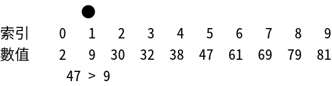

# Exponential Search

## [Table of Contents](#table-of-contents)

- [Exponential Search](#exponential-search)
  - [Table of Contents](#table-of-contents)
  - [Intro to the algorithm](#intro-to-the-algorithm)
  - [Algorithm](#algorithm)
  - [Complexity](#complexity)
  - [Applications of Exponential Search](#applications-of-exponential-search)
  - [Implementations](#implementations)

## Intro to the algorithm

In computer science, an **exponential search** (also called doubling search or galloping search) is an algorithm,  
created by Jon Bentley and Andrew Chi-Chih Yao in 1976, for searching sorted, unbounded/infinite lists.

The name of the algorithm might be misleading, as it not in exponential but in logarithmic time. The name comes from the way it searches an element.

This mechanism is used to find the range where the search key may present.  
It is an algorithm created for searching elements in huge sized arrays.

It is a two-step process. First, the algorithm tries to find the range `(L, R)` in which the target element is present and then uses binary search inside this range to find the target’s exact location.

## Algorithm

There are basically two phases involved in conducting an exponential search:

- Finding the range in which the key could sit.
- Applying binary search in this range.

**Steps**

- Start with value $i=1$.
- Check for a condition $Array[i] \le key$, where key is the element being searched.
- Increment value of $i$ in powers of 2, that is, $i=i*2$.
- Keep on incrementing the value of $i$ until the condition is met.
- Apply binary on the range $\frac{i}{2}$ to that $i$ where the condition is wrong.

## Complexity

**Average Case Complexity**  
The average-case time complexity is $O(logi)$ where $i$ is the index of target element X inside the array.  
It even outperforms binary search when the element is near the beginning of the array.

**Best Case Complexity**  
The best-case occurs when the element we compare is the element we are searching for and is returned in the first iteration. The best-case time complexity is $O(1)$.

**Worst Case Complexity**  
The worst-case time complexity is the same as the average-case time complexity.  
The worst-case time complexity is $O(logi)$.

**Space Complexity**  
This algorithm’s space complexity is $O(1)$ because it doesn’t require any extra space other than temporary variables.

## Applications of Exponential Search

- Exponential Binary Search is particularly useful for unbounded searches, where size of array is infinite.

Let's refer [Unbounded Binary Search](https://www.geeksforgeeks.org/find-the-point-where-a-function-becomes-negative/) for an example.

Given a function $f(x)$ which takes a non-negative integer $x$ as input and returns an integer as output.  
The function is monotonically increasing with respect to the value of $x$, i.e., the value of $f(x+1)$ is greater than $f(x)$ for every input $x$.  
Find the value $n$ where f() becomes positive for the first time.

## Implementations

Here are the implementations of the **exponential search** algorithm:

- [C++ implementation](implementations/exponential_search.cpp)
- [JS implementation](implementations/exponential_search.js)
