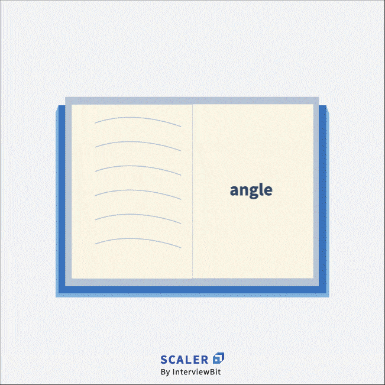
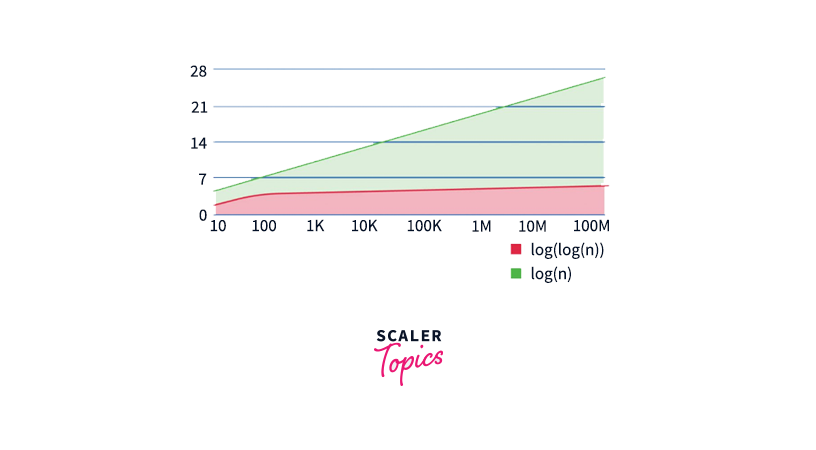

# Interpolation Search

## [Table of Contents](#table-of-contents)

- [Interpolation Search](#interpolation-search)
  - [Table of Contents](#table-of-contents)
  - [Intro to the Algorithm](#intro-to-the-algorithm)
  - [The Algorithm](#the-algorithm)
  - [Complexity](#complexity)
  - [Applications](#applications)
  - [Implementations](#implementations)

## Intro to the Algorithm

**Interpolation search** is an algorithm for searching for a key in a sorted collection.

The **Interpolation Search** is an improvement over Binary Search for instances, where the values in a sorted array are **uniformly distributed**.  
Binary Search always goes to the middle element to check. On the other hand, interpolation search may go to different locations according to the value of the key being searched.  
For example, if the value of the key is closer to the last element, interpolation search is likely to start search toward the end side.

It was first described by W. W. Peterson in 1957.  
Interpolation search resembles the method by which people search a telephone directory for a name  
(the key value by which the book's entries are ordered):

In each step the algorithm calculates where in the remaining search space the sought item might be.  
The key value actually found at this estimated position is then compared to the key value being sought.  
If it is not equal, then depending on the comparison, the remaining search space is reduced to the part before or after the estimated position.  
This method will only work if calculations on the size of differences between key values are sensible.

## The Algorithm

In the previous title we mentioned a terminology such as **uniformly distributed**.

An easy way to check uniformity is that we can check the difference between subsequent elements of the data set.  
If the difference is almost consistent and not changing significantly, then we can say the data set is **uniformly distributed**.
The values are increasing linearly in case of uniformly distributed data set.  
If the array is uniformly distributed, we can say that it will follow the path of a straight line and hence, we can represent the elements of the array using line's equation: $y = mx+c$. So, each element of the array must be represented as follows: $arr[index] = m*index +c$.

$arr[0] = m*0+c = c$,  
$arr[n-1]=m(n-1)+arr[0]$.

Let's denote $low=0$, $high = n-1$.
Now let’s say we are trying to search for an element, $K$ in this array.  
Then replacing $K$ in the above equation, we get
$K = m*index + arr[low]$
where $index$ is the probable position of $K$ in this array.

After performing a few not hard calculations, we can say that  
$m = \frac{arr[high] – arr[high]} {high – low}$

$index = low + (K-arr[low])* \frac{high-low}{arr[high]-arr[low]}$

Below is the algorithm of **Interpolation Search**:

- **Step 1:** Initialise $n$ as the length of the array, $low = 0$, $high = n-1$. We will use low and high to determine the left and right end of the array in which we will be searching at any given time.
- **Step 2:** If $low > high$, it means we have exhausted the array and we could not find $K$.  
  We `return -1 `to signify that the element $K$ was not found.
- **Step 3:** If $K < arr[low]$ || $K > arr[high]$, it means $K$ is either less than the smallest element or greater than the largest element of the current array and since the array is sorted,  
  we will never be able to find $K$ in this array. Hence, we `return -1` to signify that the element $K$ was not found.
- **Step 4:** $low \le high$
  - Initialise $index = low + (K-arr[low])* \frac{high-low}{arr[high]-arr[low]}$
  - If $arr[index] < K$, hence we repeat **Step 2** for $low = index + 1$
  - If $arr[index]>K$, hence we repeat **Step 2** for $high = index -1$
  - If $arr[index] == K$, `return index`

## Complexity

**Average Case Complexity**  
If the data set is **sorted** and **uniformly distributed**, the average case time complexity of Interpolation Search is $O(log_2(log_2(N)$ where $N$ is the total number of elements in the collection.

**Best Case Complexity**
Best case complexity for Interpolation Search is $O(1)$ when the element is found during first iteration.

**Worst Case Complexity**
If the data is sorted but quite randomized, the worst case complexity of Interpolation Search will be much worse than Binary Search.  
In fact, it’ll be almost similar to Linear Search, i.e. $O(N)$.

**Space Complexity**  
It’s quite evident that we are not using any significant extra memory in Interpolation Search.  
So the space complexity is constant, i.e. $O(1)$.  
The variables used for storing the bounds, index and other minor information are constant since they don’t depend on the input size of the array.

## Applications

Since the major requirement to use **Interpolation Search** is that the data set must be sorted and uniformly distributed,  
it has a very limited number of applications in real life, where data is actually quite randomized.

Nevertheless, if the data is indeed uniformly distributed, **Interpolation Search** performs a lot better  
than **Binary Search** as it’s evident from the below image.

## Implementations

- [C++ Implementation](implementations/interpolation_search.cpp)
- [JS Implementation](implementations/interpolation_search.js)
