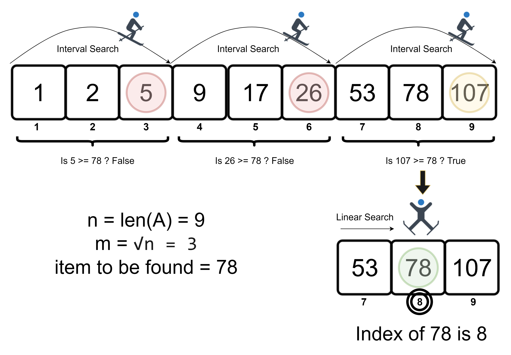

# Jump Search

## [Table of Contents](#table-of-contents)

- [Jump Search](#jump-search)
  - [Table of Contents](#table-of-contents)
  - [Intro to the algorithm](#intro-to-the-algorithm)
  - [Algorithm](#algorithm)
  - [Choose an effective value for $m$](#choose-an-effective-value-for-m)
  - [Complexity](#complexity)
  - [Advantages and Disadvantages of the algorithm](#advantages-and-disadvantages-of-the-algorithm)
    - [Disadvantages](#disadvantages)
    - [Advantages](#advantages)
  - [Implementations](#implementations)

## Intro to the algorithm

In computer science, a **jump search** or **block search** refers to another search algorithm.  
Only sorted array can alone use the jump search algorithm.  
In jump search algorithm, it is not at all necessary to scan every element in the list as we do in linear search algorithm.

We just check the $m$th element and if it is less than the key element, then we move to the $m+m$th element,  
where all the elements between $m$ element and $m+m$ element are skipped.  
This process is continued until $m$th element becomes equal to or greater than key element called boundary value.

## Algorithm

**Step 1:** Find the value of $m$.  
**Step 2:** Skip the first $m-1$ elements and check whether $m$th value is equal to or greater than key value.  
**Step 3:** If not, skip next $m-1$ elements in the array and check whether $2*m$th value is equal to or greater than key value.  
**Step 4:** If the $k*m$th value is greater than the key value, then starting from the boundary value, do linear search until the index $(k-1)m$ and return the index if key is present.  
**Step 5:** Return `-1`.

## Choose an effective value for $m$

Let's estimate how many steps are needed to perform a jump search.

In the worst case, we have to do $\frac {n}{m}$ jumps and if the last checked value is greater  
the element to be searched for, we perform $m-1$ comparisons more for linear search.

Therefore, the total number of comparisons in the worst case will be $\frac {n}{m} + m-1$.

Now, our main concern is to minimize this expression with respect to $m$.
It can easily be proved that the expression achieves its minimum when $m= \sqrt{n}$.

## Complexity

**Best Case Complexity**  
The best case complexity of this algorithm is $O(1)$. It occurs when the element to be found is located at index $m$.

**Average Case Complexity**  
The average case complexity is $O(\sqrt{n})$.

**Worst Case Complexity**  
The worst case complexity is $O(\sqrt{n})$.

**Space Complexity**  
The space complexity of this algorithm is $O(1)$ since it does not require extra memory for its implementation.

## Advantages and Disadvantages of the algorithm

### Disadvantages

- This algorithm works only for sorted input arrays.
- It is slower than binary search algorithm.

### Advantages

- It is slower than binary search algorithm which searches an element in $O(logn)$.
- In jump search the back traversing is done only once, which is lesser than in binary search.
- In the case of a system where binary search is costly, this algorithm is used.

## Implementations

Here are the implementations of the **jump search** algorithm:

- [C++ implementation](implementations/jump_search.cpp)
- [JS implementation](implementations/jump_search.js)
