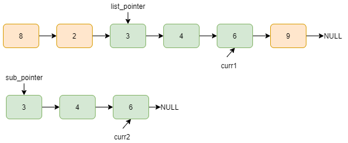
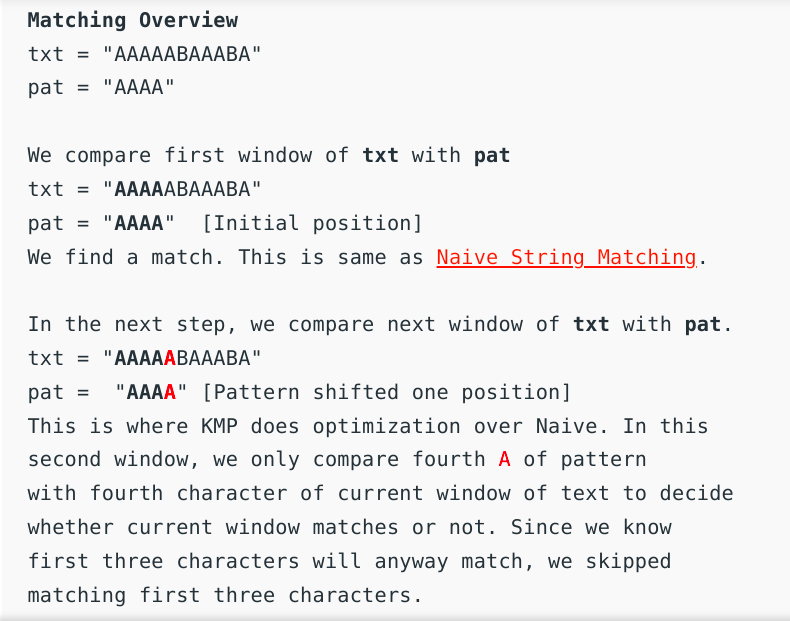
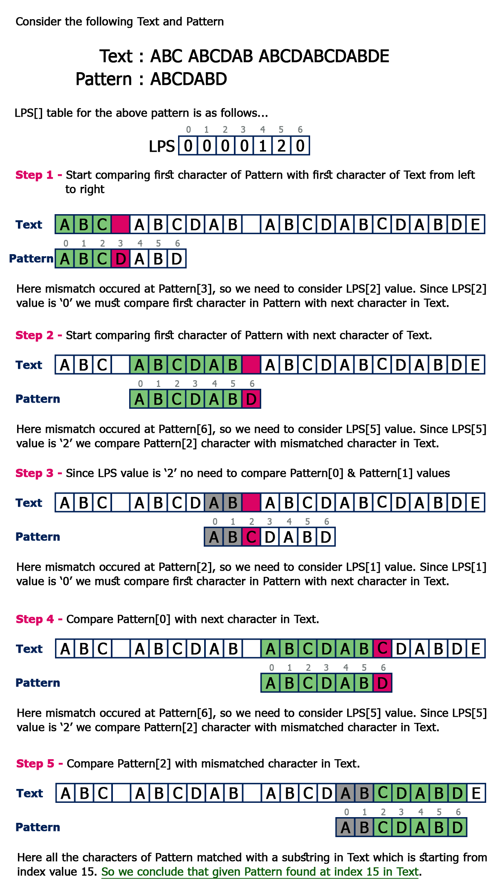
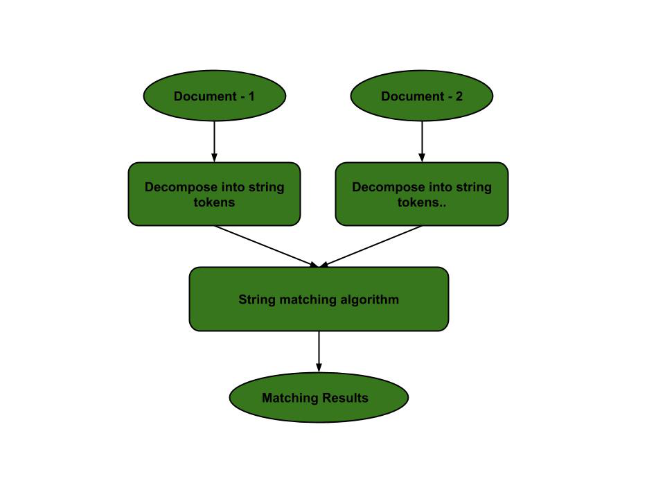
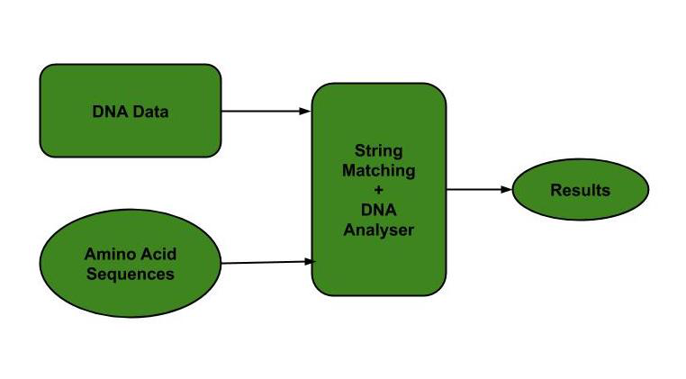
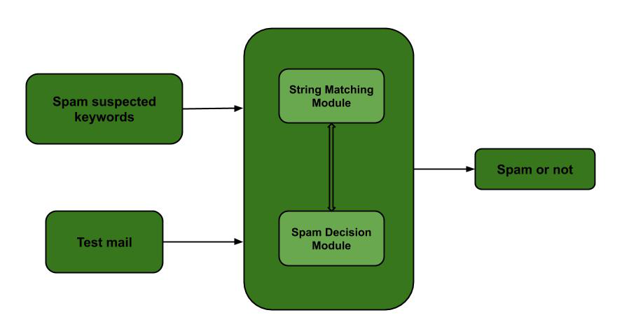

# Sublist Search (Search a linked list in another list)

## [Table of Contents](#table-of-contents)

- [Sublist Search (Search a linked list in another list)](#sublist-search-search-a-linked-list-in-another-list)
  - [Table of Contents](#table-of-contents)
  - [The Problem](#the-problem)
  - [Naive Algorithm](#naive-algorithm)
  - [**KMP(Knuth-Morris-Pratt)** Algorithm](#kmpknuth-morris-pratt-algorithm)
    - [**Preprocessing Overview**](#preprocessing-overview)
    - [**Searching Algorithm**](#searching-algorithm)
  - [Complexity](#complexity)
    - [Complexity of the **Naive Approach**](#complexity-of-the-naive-approach)
    - [Complexity of the **KMP** Algorithm](#complexity-of-the-kmp-algorithm)
  - [Applications](#applications)
  - [Implementations](#implementations)

## The Problem

The problem is as follows:  
_Given two linked lists, the task is to check whether the first list is present in 2nd list or not._

Here, we described the problem for 2 linked lists, but the main problem concerns to **pattern searching problem**.  
The pattern itself can be either a list, or a string, or any other data structure.

Pattern searching is an important problem in computer science.  
For example, when computer performs a **search** in notepad/word file or browser or database,  
pattern searching algorithms are used to show the search results.

## Naive Algorithm

The sub-list search **naive** algorithm works by comparing the first element of the first list with the first element of the second list.  
If the two values don't match, it moves to the next member in the second list.  
It does this until the two values match.

Here are the steps for naive approach implementation.

Let's assume we have `list1` as a pattern, and we have to find its presence in `list2`.

- **Step 1:** Take first node of `list2`.
- **Step 2:** Start matching the `list1` from this first node.
- **Step 3:** If whole lists match `return true`.
- **Step 4:** Else break and take `list1` to the first node again.
- **Step 5:** And take `list2` to its second node.
- **Step 6:** Repeat these steps until any of linked lists becomes empty.
- **Step 7:** If first list becomes empty then list found else not.



## **KMP(Knuth-Morris-Pratt)** Algorithm

The Naive pattern searching algorithm doesn’t work well in cases where we see many matching characters followed by a mismatching character.  
Following are some examples.

```JS
txt[] = "AAAAAAAAAAAAAAAAAB"
pat[] = "AAAAB"

txt[] = "ABABABCABABABCABABABC"
pat[] =  "ABABC"
```

The basic idea behind KMP’s algorithm is: whenever we detect a mismatch (after some matches),  
we already know some characters in the text of the next window.  
We take advantage of this information to avoid matching the characters that we know will anyway match.  
Let us consider below example to understand this.

<!--  -->

An important question arises from the above explanation,
how to know how many characters to be skipped.  
To know this,
we pre-process pattern and prepare an integer array
`lps[]` that tells us the count of characters to be skipped.

### **Preprocessing Overview**

- **KMP** algorithm preprocesses `pat[]` and constructs an auxiliary `lps[]` of size `m` (same as size of pattern) which is used to skip characters while matching.
- **name lps indicates longest proper prefix which is also suffix**.  
  A proper prefix with whole string not allowed.  
  For example, prefixes of **“ABC”** are `“”, “A”, “AB” and “ABC”`.  
  Proper prefixes are `“”, “A” and “AB”`.  
  Suffixes of the string are `“”, “C”, “BC” and “ABC”`.
- We search for `lps` in sub-patterns. More clearly we focus on sub-strings of patterns that are either prefix and suffix.
- For each sub-pattern `pat[0..i]` where `i = 0` to `m-1`,  
  `lps[i]` stores length of the maximum matching proper prefix which is also a suffix of the sub-pattern `pat[0..i]`.
  ```JS
  lps[i] = the longest proper prefix of pat[0..i]
              which is also a suffix of pat[0..i].
  ```

```
Examples of lps[] construction:
For the pattern “AAAA”,
lps[] is [0, 1, 2, 3]

For the pattern “ABCDE”,
lps[] is [0, 0, 0, 0, 0]

For the pattern “AABAACAABAA”,
lps[] is [0, 1, 0, 1, 2, 0, 1, 2, 3, 4, 5]

For the pattern “AAACAAAAAC”,
lps[] is [0, 1, 2, 0, 1, 2, 3, 3, 3, 4]

For the pattern “AAABAAA”,
lps[] is [0, 1, 2, 0, 1, 2, 3]
```

### **Searching Algorithm**

Unlike Naive algorithm, where we slide the pattern by one and compare all characters at each shift, we use a value from lps[] to decide the next characters to be matched.  
The idea is to not match a character that we know will anyway match.

**How to use `lps[]` to decide next positions (or to know a number of characters to be skipped)?**

- We start comparison of `pat[j]` with j = 0 with characters of current window of text.
- We keep matching characters `txt[i]` and `pat[j]` and keep incrementing i and j while `pat[j]` and `txt[i]` keep matching.
- When we see a **mismatch**:
  - We know that characters `pat[0..j-1]` match with `txt[i-j…i-1]` (Note that j starts with 0 and increment it only when there is a match).
  - We also know (from above definition) that `lps[j-1]` is count of characters of `pat[0…j-1]` that are both proper prefix and suffix.
  - From above two points, we can conclude that we do not need to match these `lps[j-1]` characters with `txt[i-j…i-1]` because we know that these characters will anyway match.



## Complexity

### Complexity of the **Naive Approach**

**Best Case Complexity**  
The best case occurs when the first number of the pattern is not present in text at all.  
The number of comparisons in the best case is $O(m)$.

```JS
let list1 = 5 -> 2 -> 3
let list2 = 1 -> 2 -> 3 -> 4 -> 6
```

**Worst Case Complexity**  
The worst case complexity is $O(m*n$) where `n` is the number of nodes in second list and `m` in first.  
It occurs when only the last number is different. E.g.

```JS
let list1 = 1 -> 1 -> 2
let list2 = 1 -> 1 -> 1-> 1 -> 1 -> 1 -> 2
```

**Average Case Complexity**  
The average case complexity is estimated to be same as the worst case complexity.

**Space Complexity** - $O(1)$

### Complexity of the **KMP** Algorithm

**Best Case Complexity** - $O(m)$  
**Worst Case Complexity** - $O(m+n)$  
**Average Case Complexity** - $O(m+n)$  
**Space Complexity** - $O(m)$

## Applications

- **Plagiarism Detection**  
  The documents to be compared are decomposed into string tokens and compared using string matching algorithms.  
  Thus, these algorithms are used to detect similarities between them and declare if the work is plagiarized or original.

  

- **Bioinformatics and DNA Sequencing**  
  Bioinformatics involves applying information technology and computer science to problems involving genetic sequences to find DNA patterns.  
  String matching algorithms and DNA analysis are both collectively used for finding the occurrence of the pattern set.



- **Spam filters**  
  To categorize an email as spam or not, suspected spam keywords are searched in the content of the email by string matching algorithms.  
  Hence, the content is classified as spam or not.



## Implementations

[JS Naive Implementation](implementations/sublist_search_naive.js)

[JS KMP Implementation](implementations/sublist_search_kmp.js)
